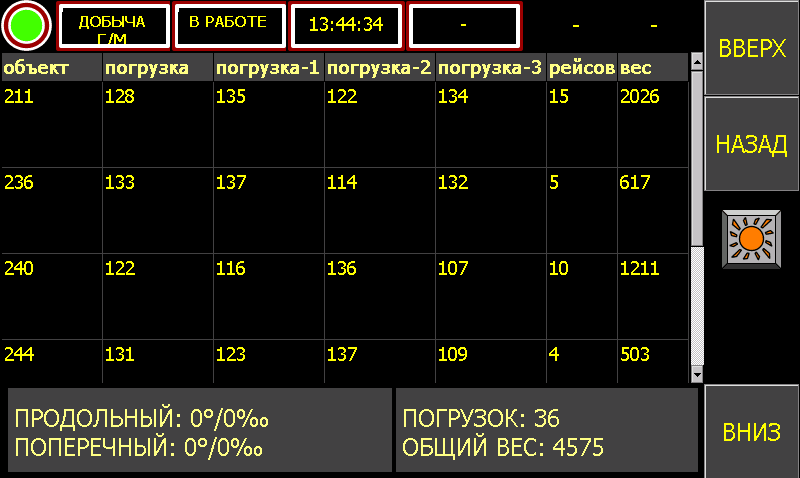

<h1>ИС "Карьер".HTTP API: интеграционный интерфейс</h1>

Программный интерфейс информационной системы "Карьер" предприятия, 
предназначенный для интеграции с управляющим ПО бортовых компьютеров единиц 
техники участка экскавации по протоколу HTTP.



[**ИСТОРИЯ ВЕРСИЙ**]() | **Текущие версии**:

| Схема  | Хост             | Экземпляр    | Версия API | Интерактивная документация                 |
| ------ | ---------------- | ------------ | ---------- | ------------------------------------------ |
| `HTTP` | `IP:PORT`        | `PRODUCTION` | `2.0.0`    | [Ссылка]()                                 |

<!-- markdown-toc start - Don't edit this section. Run M-x markdown-toc-refresh-toc -->
**Содержание**

- [Структура проекта](#структура-проекта)
    - [Общая структура директории `deploy`](#общая-структура-директории-deploy)
- [Среда разработки](#среда-разработки)
    - [Программное обеспечение](#программное-обеспечение)
    - [Клонирование репозитория](#клонирование-репозитория)
    - [Запуск среды разработки](#запуск-среды-разработки)
    - [Запуск автоматизированных тестов](#запуск-автоматизированных-тестов)
        - [Отдельно средствами leinigen](#отдельно-средствами-leinigen)
        - [В среде разработки](#в-среде-разработки)
    - [Проверка новых версий зависимых библиотек проекта](#проверка-новых-версий-зависимых-библиотек-проекта)
    - [Проверка рекомендаций по идиоматике исходного кода](#проверка-рекомендаций-по-идиоматике-исходного-кода)
- [Сборка экземпляра приложения](#сборка-экземпляра-приложения)
- [Развертывание экземпляра приложения](#развертывание-экземпляра-приложения)
    - [Развертывание экземпляра приложения с нуля](#развертывание-экземпляра-приложения-с-нуля)
    - [Развертывание новой версии экземпляра приложения](#развертывание-новой-версии-экземпляра-приложения)

<!-- markdown-toc end -->
 
# Структура проекта

| Файл / директория | Назначение                                                                   |
| ----------------- | ---------------------------------------------------------------------------- |
| `deploy`          | Файлы для развертывания экземпляра приложения                                |
| `logs`            | Журнал работы приложения (директория создается при запуске среды разработки) |
| `src`             | Исходный код приложения                                                      |
| `test`            | Исходный код автоматизированных тестов                                       |
| `.gitignore`      | Перечень игнорируемых файлов для git scm                                     |
| `config.edn`      | Конфигурация `dev` экземпляра приложения                                     |
| `CHANGELOG.md`    | История версий                                                               |
| `HTTP_API.md`     | Описание интеграционного интерфейса                                          |
| `project.clj`     | Описание проекта leiningen                                                   |
| `README.md`       | Основной документ проекта                                                    |

## Общая структура директории `deploy`

Ниже показана общая структура директории для размещения файлов развертывания
экземпляра приложения:

| Файл / директория       | Назначение                                                  |
| ----------------------- | ----------------------------------------------------------- |
| `app`                   | Директория для размещения jar-архива                        |
| `bin`                   | Директория для размещения `procrun` (Apache Commons Daemon) |
| `conf`                  | Директория для файлов конфигураций                          |
| `license`               | Директория для лицензий сторонних приложений и библиотек    |
| `install-service.bat`   | Скрипт инсталляции Windows-службы                           |
| `restart-service.bat`   | Скрипт перезапуска Windows-службы                           |
| `start-console.bat`     | Скрипт запуска приложения в режиме консоли                  |
| `start-service.bat`     | Скрипт запуска Windows-службы                               |
| `uninstall-service.bat` | Скрипт удаления Windows-службы                              |

# Среда разработки

## Программное обеспечение

Для работы над проектом необходимо установить следующее программное обеспечение:

- `Apache Maven` (среда сборки - только для установки `ojdbc8`).
- `leiningen` (инструмент для автоматизации сборки и управления зависимостями
  для простой конфигурации программных проектов на Clojure).
- Редактор кода или IDE с поддержкой Clojure (`VS code + Calva`,
  `Atom + proto-repl`, `emacs + CIDER` и т.п.).

## Клонирование репозитория

```bash
$ cd path/to/your/projects/folder
$ git clone http://10.172.187.34/devgroup/acds-shovels.git
```

## Запуск среды разработки

*На примере VS Code + Calva*:

Перейти в директорию с проектом, открыть ее в VS Code:

```bash
$ cd /path/to/acds-shovels
$ code .
```

Запустить команду 'Start a Project REPL and Connect': `ctrl+alt+c ctrl+alt+j`.

Выбрать тип проекта и запускаемый профиль, будет запущен REPL и можно приступать
к разработке.

## Запуск автоматизированных тестов

### Отдельно средствами leinigen

```bash
$ lein test
```

### В среде разработки

*На примере VS Code + Calva*:

- Запустить тесты пространства имен: `ctrl+alt+c t`
- Запустить все тесты: `ctrl+alt+c shift+t`
- Запустить текущий тест: `ctrl+alt+c ctrl+alt+t`
- Перезапутсить тесты, завершившиеся с ошибкой: `ctrl+alt+c ctrl+t`

## Проверка новых версий зависимых библиотек проекта

```bash
$ lein ancient
```

Справка:

```bash
$ lein ancient -h
```

## Проверка рекомендаций по идиоматике исходного кода

```bash
$ lein kibit
```

Справка:

```bash
$ lein kibit -h
```

# Сборка экземпляра приложения

Скомпилировать приложение в самодостаточный `.jar` архив:

```bash
lein uberjar
```

Разместить полученный архив в директорию `deploy`:

```bash
copy /path/to/acds-shovels/target/acds-shovels.jar /path/to/acds-shovels/deploy/app
```

Подготовить скрипты управления службой Windows и конфигурацию для
соответствующего экземпляра приложения.

# Развертывание экземпляра приложения

Экземпляр приложения запускается в среде ОС Windows в качестве службы, для этого
используется
[Apache Commons Daemon (procrun)](https://commons.apache.org/proper/commons-daemon/procrun.html)

## Развертывание экземпляра приложения с нуля

1. Развернуть на сервере `Java SE 8 (Server JRE)`.

2. Скопировать все директории и файлы из директории `deploy` в директорию
приложения на сервере.

3. Запустить на сервере скрипт `install-service.bat` от имени администратора.

## Развертывание новой версии экземпляра приложения

1. Запустить на сервере скрипт `stop-service.bat` от имени администратора или
от имени своего пользователя, если есть доступ на управление службой.

2. Скопировать файл `acds-shovels.jar` из директории `deploy\app` в директорию
`app` приложения на сервере.

3. По необходимости, внести изменения в конфигурацию службы Windows (см.
  документацию Apache Commons Daemon (procrun)).

4. Запустить на сервере скрипт `start-service.bat` от имени администратора или
от имени своего пользователя, если есть доступ на управление службой.
